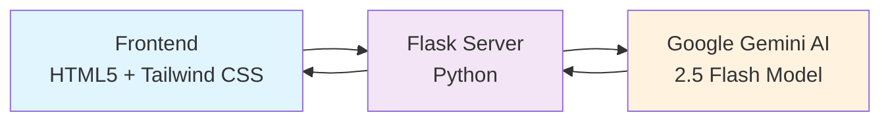
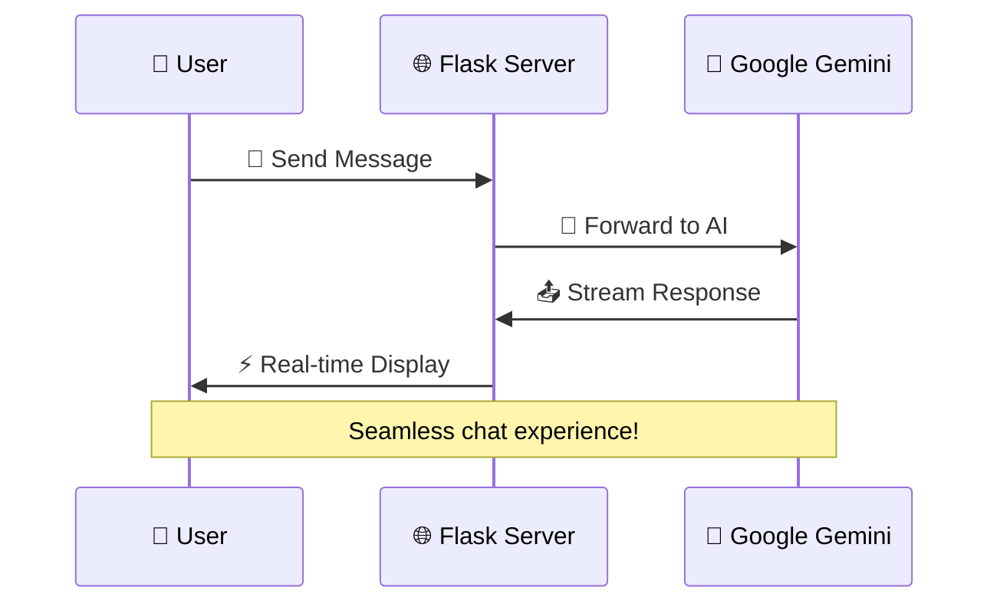

# 🤖 FlaskGPT - Professional AI Chat Assistant

<div align="center">


A sleek, modern web application that brings the power of Google's Gemini AI to your browser. Built with Python Flask, this project delivers a ChatGPT-like experience with real-time streaming responses and a beautiful user interface.

[](https://www.python.org/)
[](https://flask.palletsprojects.com/)
[](https://ai.google.dev/)
[](LICENSE)

</div>

---

## ✨ Key Features

<table>
<tr>
<td width="50%">

### 🚀 **Real-time Streaming**
Watch AI responses appear instantly as they're generated. No more waiting for complete responses!

</td>
<td width="50%">

### 💬 **Professional Chat Interface**
Clean, modern design with smooth animations and typing indicators.

</td>
</tr>
<tr>
<td width="50%">

### 🧠 **Google Gemini Powered**
Fast, intelligent responses using Google's latest AI model technology.

</td>
<td width="50%">

### 📱 **Fully Responsive**
Works perfectly on desktop, tablet, and mobile devices.

</td>
</tr>
</table>

---

## 🛠️ Technology Stack

<div align="center">



</div>

### Core Technologies
- **🐍 Backend**: Python Flask with Server-Sent Events
- **🤖 AI Model**: Google Gemini 2.5 Flash
- **🎨 Frontend**: HTML5, JavaScript, Tailwind CSS
- **⚡ Real-time**: Server-Sent Events (SSE) for instant streaming

---

## 🚀 Quick Start

### Step 1️⃣ - Install Dependencies

```bash
pip install -r requirements.txt
```

### Step 2️⃣ - Configure API Key

Create a `.env` file with your Google AI API key:

```env
GOOGLE_API_KEY="your_google_api_key_here"
```

> 💡 **Tip**: Get your free API key from [Google AI Studio](https://aistudio.google.com/app/apikey)

### Step 3️⃣ - Launch the Application

```bash
python app.py
```

### Step 4️⃣ - Open in Browser

Navigate to: **http://127.0.0.1:5000**

---

## 📁 Project Architecture

<div align="center">

```
FlaskGPT-project/
├── 📄 app.py              # Main Flask application
│   ├── 🔗 Routes (/ and /prompt)
│   ├── 🤖 Gemini AI integration
│   └── 📡 Server-Sent Events
├── 📁 templates/
│   └── 🎨 index.html      # Beautiful chat interface
├── 📁 static/             # CSS, JS, and images
│   ├── 🎭 dist/css/
│   └── ⚡ dist/js/
├── 🔐 .env               # Environment variables
├── 📋 requirements.txt   # Python dependencies
└── 📖 README.md         # This beautiful file
```

</div>

---

## 🎯 How It Works

<div align="center">



</div>

1. **👤 User** sends message through the beautiful web interface
2. **🌐 Flask server** receives and forwards request to Google Gemini
3. **🤖 AI processes** message and generates intelligent response
4. **📤 Response streams** back in real-time using Server-Sent Events
5. **⚡ Frontend displays** response with smooth animations and typing indicators

---

## 🔧 System Requirements

- **🐍 Python** 3.7 or higher
- **🔑 Google AI API key** (free)
- **🌐 Modern web browser** (Chrome, Firefox, Safari, Edge)

---

## 🌟 Why FlaskGPT?

- **⚡ Lightning Fast** - Optimized for speed with Flask and Gemini Flash
- **🎨 Beautiful Design** - Modern UI that rivals commercial AI assistants
- **🔧 Easy Setup** - Get running in under 5 minutes
- **📱 Mobile Ready** - Perfect chat experience on any device
- **🆓 Free to Use** - No hidden costs or premium features

---

<div align="center">

**Built with ❤️ using Python Flask and Google Gemini AI**

[](https://github.com/yourusername/FlaskGPT-project)
[](https://github.com/yourusername/FlaskGPT-project/fork)

</div>
